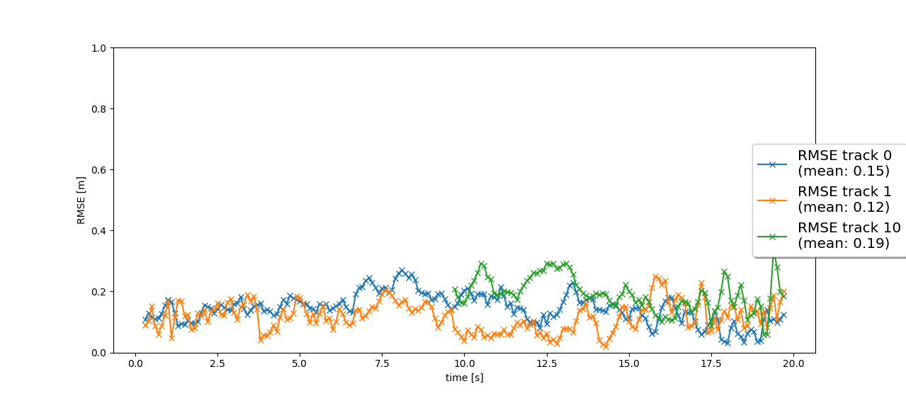
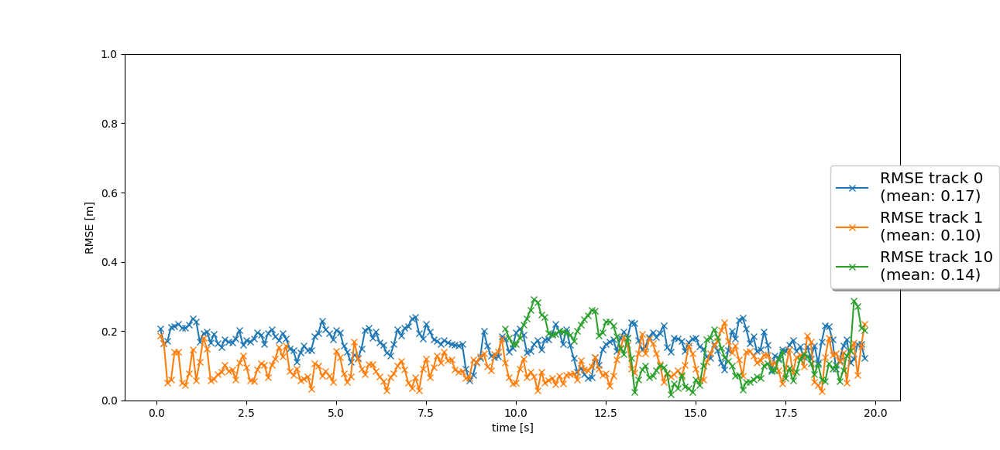

# Writeup: Track 3D-Objects Over Time

Please use this starter template to answer the following questions:

### 1. Write a short recap of the four tracking steps and what you implemented there (filter, track management, association, camera fusion). Which results did you achieve? Which part of the project was most difficult for you to complete, and why?

## Step1: EKF
- Using EKF, we can accurately estimate the state of objects in the scene.
- This process corresponds to the predict and update step in Tracking Flow Chart.

## Step2: Track management
- This module manages the tracks. Specifically, handling track scores and covariance matrices P and determine whether to delete the tracker or not.
- This helps prevent false positive trackers in the scene.

## Step3: Association
- To handle multi target tracking, we need to associate trackers and measurements one-to-one to update the state of the tracker.
- This module associate each tracker and measurement according to Mahalanobis distance.
- If trackers remain, decrease the score, and if measurements remain, initialize new trackers.

## Step4: Camera fusion
- This module helps handle the data recorded by camera.
- We use EKF because the vehicle-to-sensor function hx is non-linear.

### 2. Do you see any benefits in camera-lidar fusion compared to lidar-only tracking (in theory and in your concrete results)? 
- Theoritically, camera-lidar fusion would be more robust because multiple sensor measurement makes the update step of Kalman Filter more accurate and reliable.
- However, I didn't see obvious changes between camera-lidar and lidar-only systems in the scenario of the exercise (although mean RMSE slightly decreased). Below is the result of both cases.

lidar only

lidar and camera

### 3. Which challenges will a sensor fusion system face in real-life scenarios? Did you see any of these challenges in the project?
In real-life scenarios, it would be difficult for this system to handle objects that appear suddenly because it needs some timesteps to confirm trackers. If an object suddenly appears and there aren't enough timesteps, this system may regard the object as "tentative".

### 4. Can you think of ways to improve your tracking results in the future?
- Improve the detection models of camera and lidar by fine tuning or model configurations.
- Modify the association algorythm with the other one such as Probabilistic Data Association
- Test with different initialize parameters of trackers
